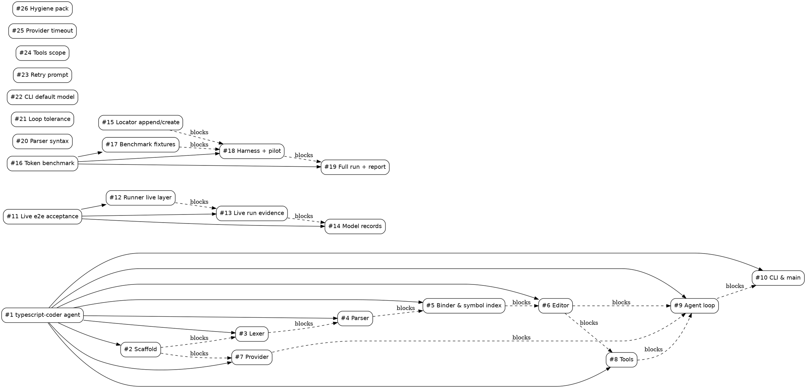

# Issues

Issue tree: structure only. Statuses, priorities, and picking order live in
[`todo.yaml`](todo.yaml).

```dot
digraph issues {
  rankdir=LR;
  node [shape=box, style=rounded, fontname="Helvetica"];

  "1"  [label="#1 typescript-coder agent"];
  "2"  [label="#2 Scaffold"];
  "3"  [label="#3 Lexer"];
  "4"  [label="#4 Parser"];
  "5"  [label="#5 Binder & symbol index"];
  "6"  [label="#6 Editor"];
  "7"  [label="#7 Provider"];
  "8"  [label="#8 Tools"];
  "9"  [label="#9 Agent loop"];
  "10" [label="#10 CLI & main"];
  "11" [label="#11 Live e2e acceptance"];
  "12" [label="#12 Runner live layer"];
  "13" [label="#13 Live run evidence"];
  "14" [label="#14 Model records"];
  "15" [label="#15 Locator append/create"];
  "16" [label="#16 Token benchmark"];
  "17" [label="#17 Benchmark fixtures"];
  "18" [label="#18 Harness + pilot"];
  "19" [label="#19 Full run + report"];
  "20" [label="#20 Parser syntax"];
  "21" [label="#21 Loop tolerance"];
  "22" [label="#22 CLI default model"];
  "23" [label="#23 Retry prompt"];
  "24" [label="#24 Tools scope"];
  "25" [label="#25 Provider timeout"];
  "26" [label="#26 Hygiene pack"];

  // tree edges (parent -> child), solid
  "1" -> "2";
  "1" -> "3";
  "1" -> "4";
  "1" -> "5";
  "1" -> "6";
  "1" -> "7";
  "1" -> "8";
  "1" -> "9";
  "1" -> "10";
  "11" -> "12";
  "11" -> "13";
  "11" -> "14";
  "16" -> "17";
  "16" -> "18";
  "16" -> "19";

  // dependency edges (blocker -> blocked), dashed
  "2" -> "3" [style=dashed, label="blocks"];
  "3" -> "4" [style=dashed, label="blocks"];
  "4" -> "5" [style=dashed, label="blocks"];
  "5" -> "6" [style=dashed, label="blocks"];
  "2" -> "7" [style=dashed, label="blocks"];
  "6" -> "8" [style=dashed, label="blocks"];
  "6" -> "9" [style=dashed, label="blocks"];
  "7" -> "9" [style=dashed, label="blocks"];
  "8" -> "9" [style=dashed, label="blocks"];
  "9" -> "10" [style=dashed, label="blocks"];
  "12" -> "13" [style=dashed, label="blocks"];
  "13" -> "14" [style=dashed, label="blocks"];
  "15" -> "18" [style=dashed, label="blocks"];
  "17" -> "18" [style=dashed, label="blocks"];
  "18" -> "19" [style=dashed, label="blocks"];
}
```
